# PRÁCTICA 1: Entrada/Salida utilizando interrupciones con lenguaje C

*Autor: Daniel Carrasco Moreno (Grado de Ingeniería Informática, Universidad de Granada)*

En esta práctica vamos a acceder a las rutinas de servicio a interrupción de la BIOS , tanto para teclado como para video, usando DOSBOX.Vamos a utilizar el lenguaje de programación C para realizar interrupciones software a través de la función no estándar int86().

El objetivo principal de esta primera práctica era implementar 9 funciones similares a las ofrecidas por la biblioteca conio.lib (Console Input Output Library).

Estas son las 9 funciones implementadas:
- `gotoxy`
- `setcursortype`
- `getvideomode`
- `textcolor`
- `textbackground`
- `clscr`
- `cputchar`
- `getche`

### Menu

En primer lugar, he implementado un sencillo menú a través de un simple `switch` en el cual, introduciendo un número del [1-10], nos ejecutará cada una de las funciones anteriormente nombradas.

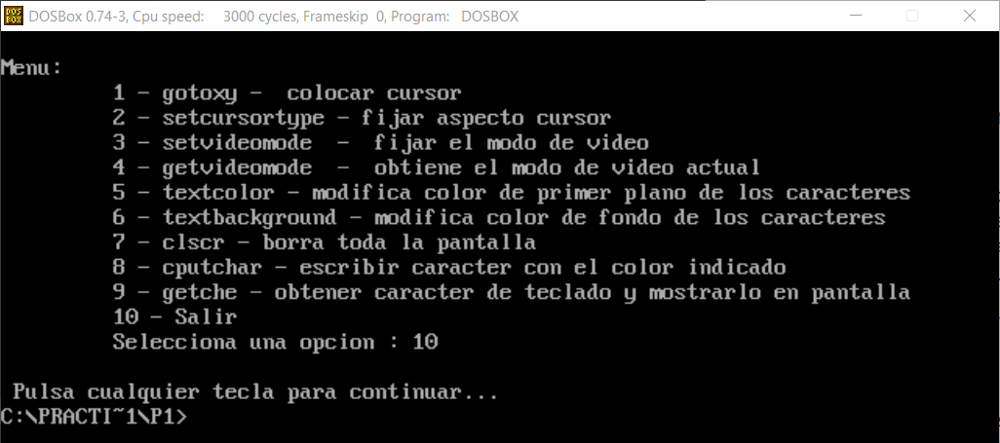

### [1] gotoxy - Colocar cursor en una posicion determinada

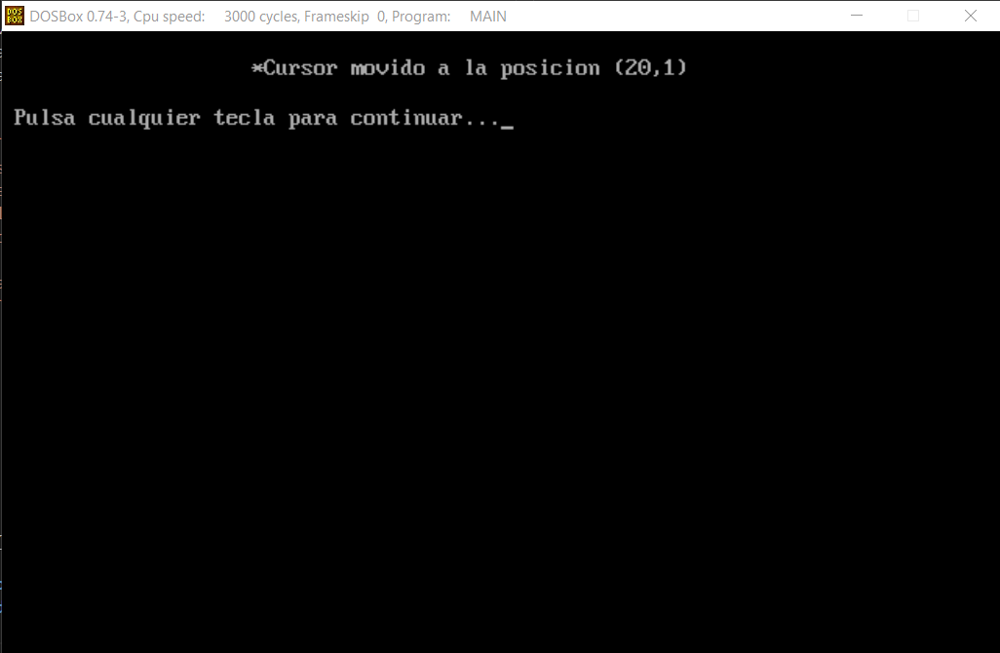
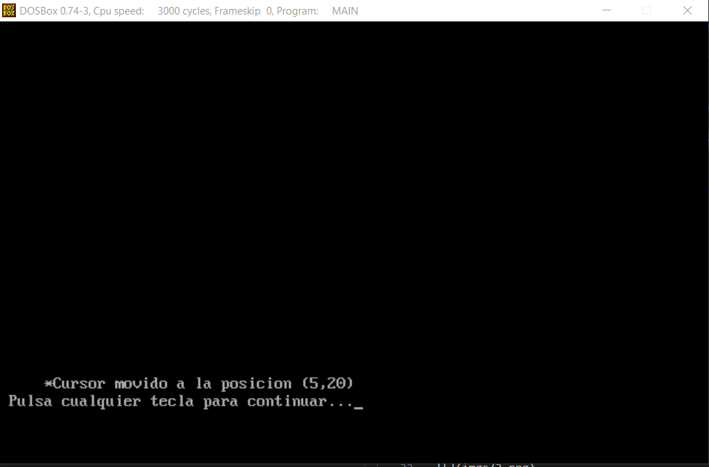
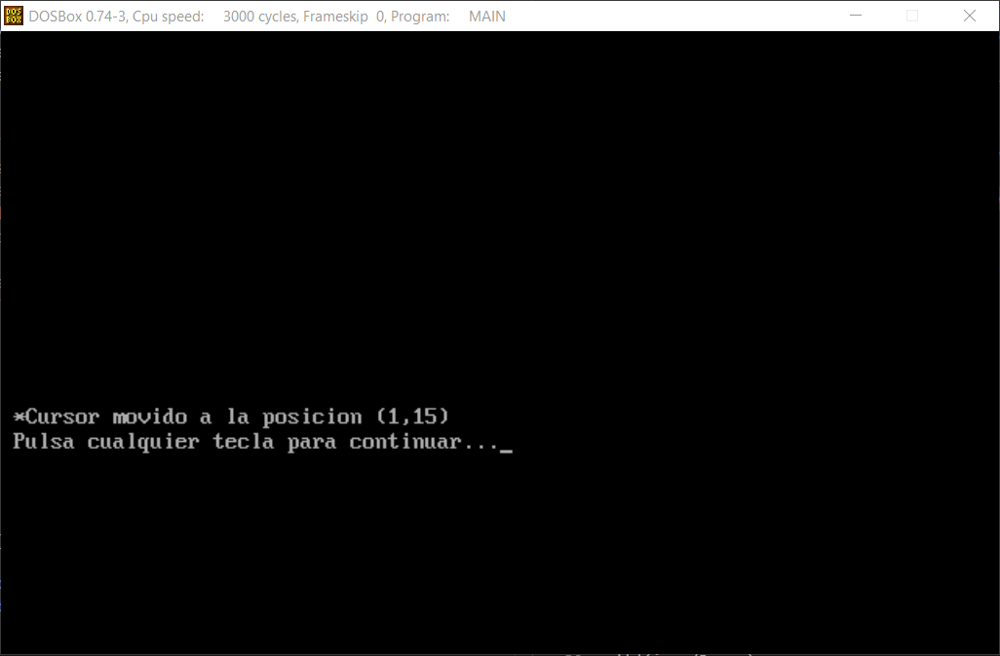

### [2] setcursortype - Fija el aspecto del cursor
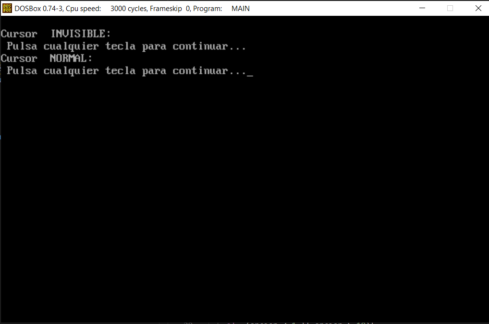
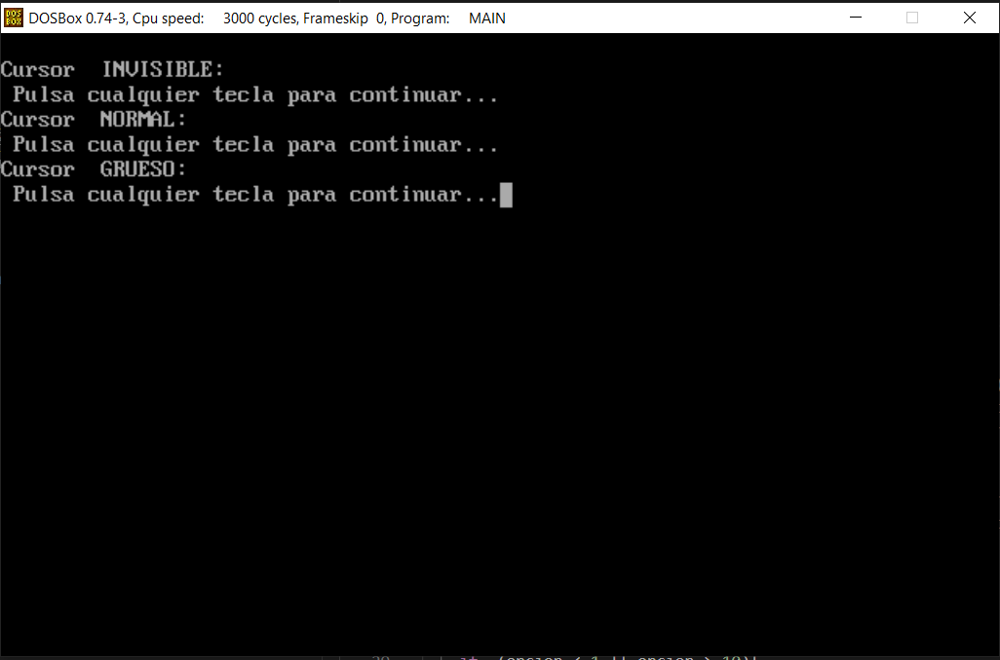

### [3] setvideomode - Fijar el modo de video
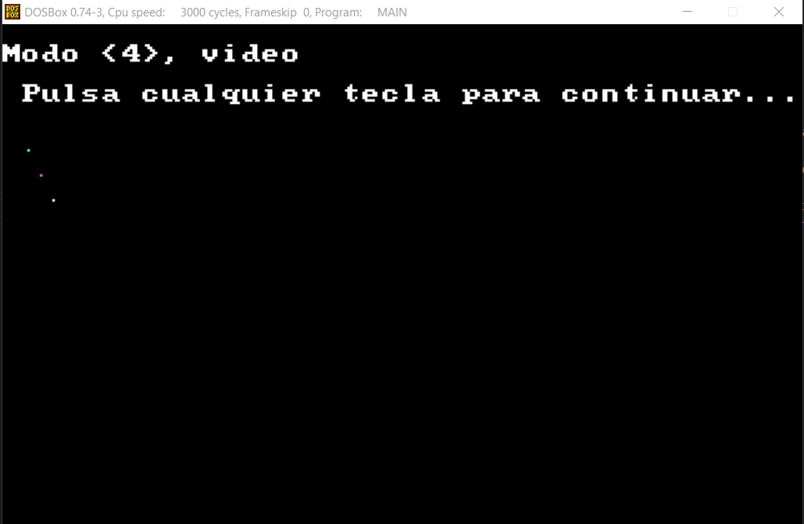
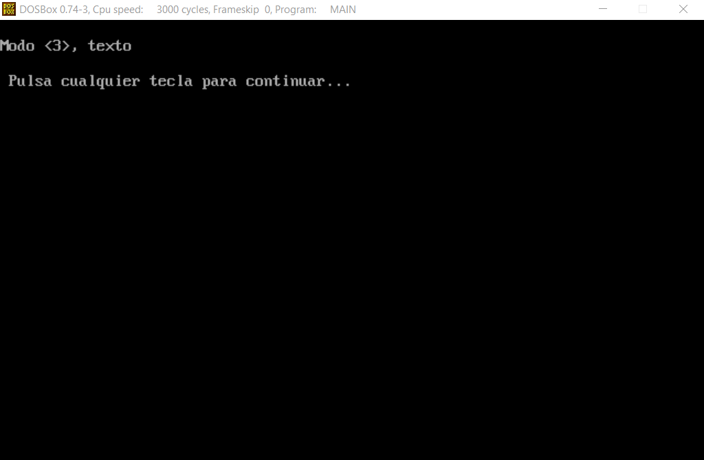

### [4] getvideomode - Obtiene el modo de video actual
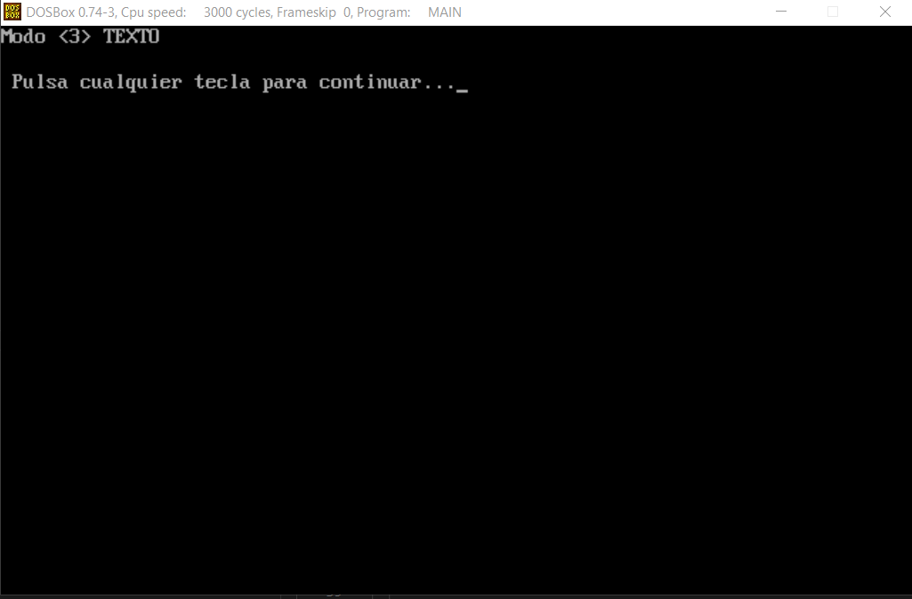

### [5] textcolor - Modifica el color de primer plano con que se mostrarán los caracteres
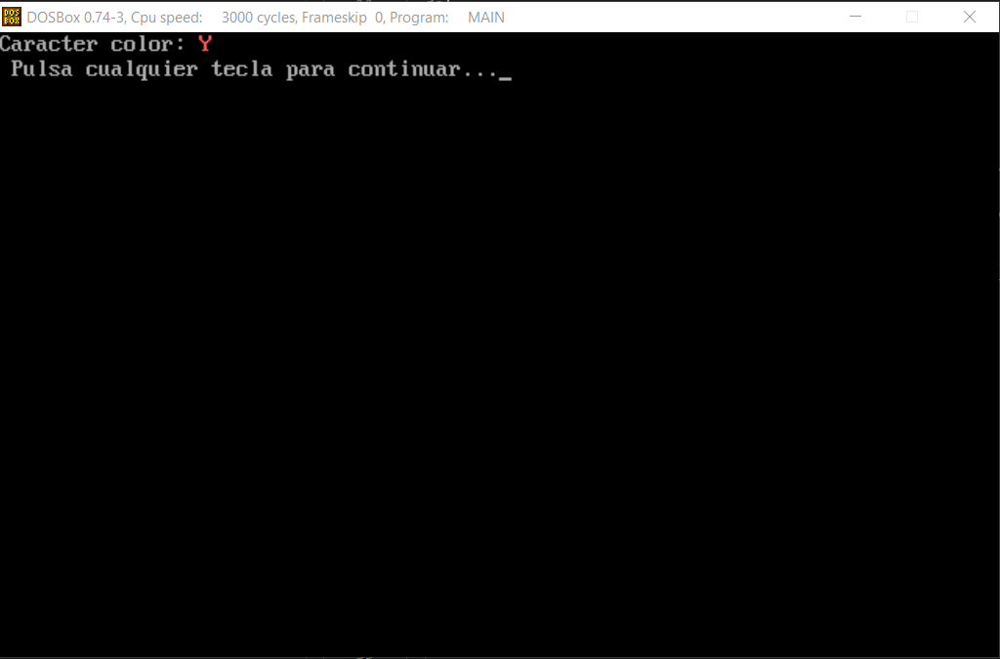

### [6] textbackground - Modifica el color de fondo de los caracteres
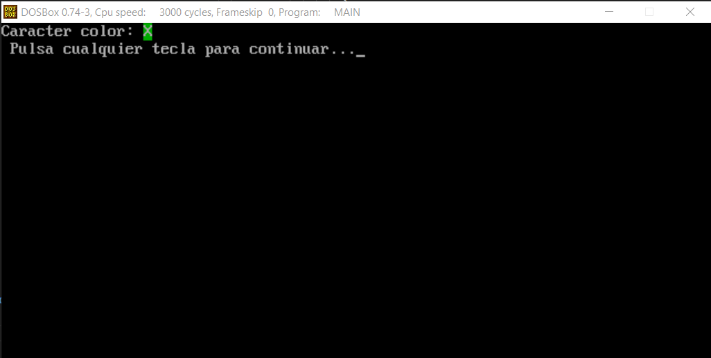

### [7] clscr - Borra toda la pantalla
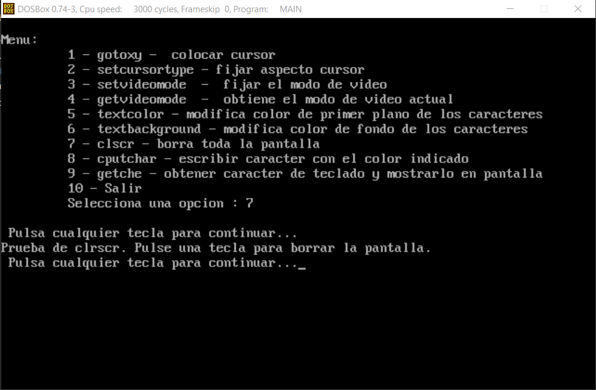
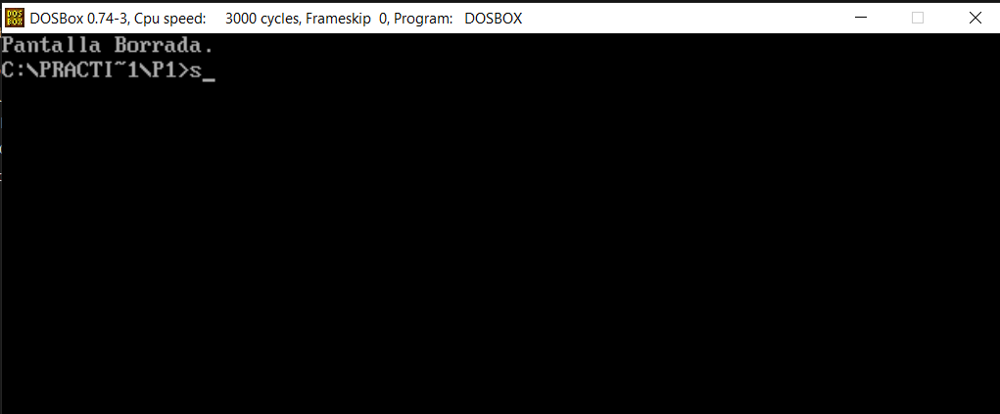

### [8] cputchar - Escribir caracter con el color indicado
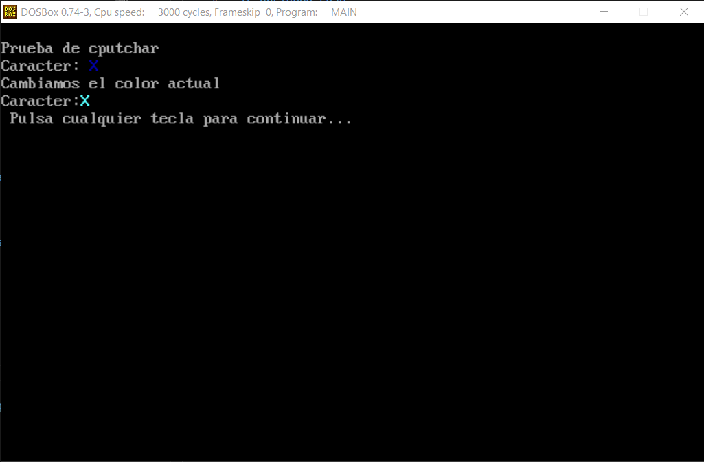

### [9] getche - Obtener carácter de teclado y mostrarlo en pantalla
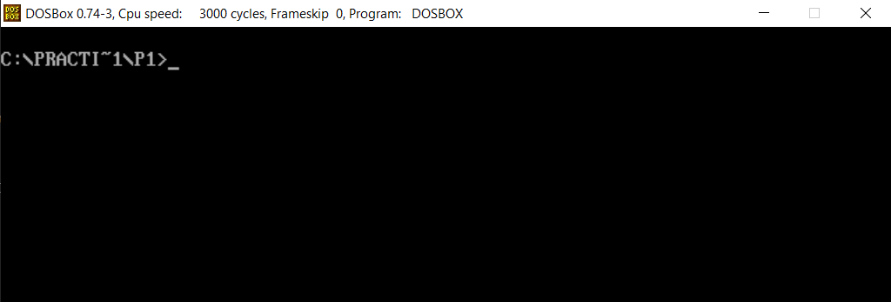

