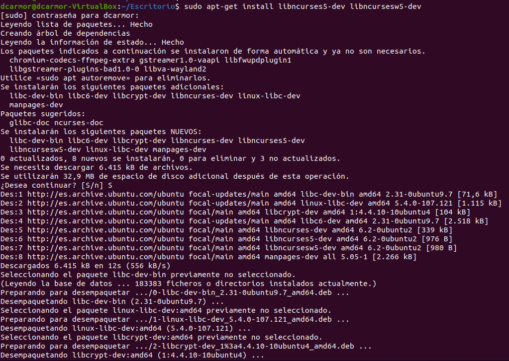

# PRÁCTICA 2: Uso de bibliotecas de programación de interfaces de usuario en modo texto

*Autor: Daniel Carrasco Moreno (Grado de Ingeniería Informática, Universidad de Granada)*


El objetivo de la práctica 2 son:

- Instalar la librería ncurses en Linux
- Crear programas sencillos basados en ncurses

<div style="text-align: justify">
En la primera parte de la práctica 2 vamos a instalar la librería ncurses, esencial para comenzar a realizar las siguientes partes de la práctica.
En mi caso, he utilizado una máquina virtual con Ubuntu (versión 20.04 LTS ) de su página oficial [Ubuntu](https://ubuntu.com/download).
</div>). 
</div>
<br/>

Para instalar hacemos uso del siguiente comando:
```Bash
sudo apt-get install libncurses5-dev libncursesw5-dev
```




