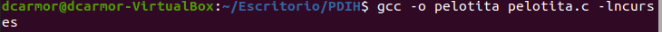

# PRÁCTICA 2: Uso de bibliotecas de programación de interfaces de usuario en modo texto

*Autor: Daniel Carrasco Moreno (Grado de Ingeniería Informática, Universidad de Granada)*


El objetivo de la práctica 2 son:

- Instalar la librería ncurses en Linux
- Crear programas sencillos basados en ncurses

<div style="text-align: justify">
En la primera parte de la práctica 2 vamos a instalar la librería ncurses, esencial para comenzar a realizar las siguientes partes de la práctica.
</div>). 
</div>
<br/>

Para instalar hacemos uso del siguiente comando:
```Bash
sudo apt-get install libncurses5-dev libncursesw5-dev
```

En mi caso, he utilizado una máquina virtual con Ubuntu (versión 20.04 LTS ) de su página oficial [Ubuntu](https://ubuntu.com/download "Pagina oficial de Ubuntu").


### [1] Programas de ejemplo

A continuación vamos a comprobar el funcionamiento de los programas de ejemplo del guion.


#### Programa 1 : Mostrar una ventana en el terminal
<div style="text-align: justify">
Este sencillo programa va a mostrar una pantalla con color de fondo azul
y mostrará una cadena de texto en ella.

Primero debemos mostrar la ventana, con sus marcos y un color de fondo y
por otro lado, para mostrar los colores y el fondo de la vetana, debemos crear "pares de colores".


En el código en primer lugar nos encargamos de iniciar , crear y configurar el soporte para colores:

Algunas de las funciones más relevantes que utilizaremos son:

- `has_colors()`  Comprueba si el terminal permite mostrar colores
- `start_color()` Inicia el soporte de colores en la aplicación
- `init_pair()` Crea nuevos pares de colores de fondo y de caracteres,  le asigna un número al nuevo par.
- `clear()` Limpia el contenido de la ventana

Luego, procedemos con la configuración de la ventana, para ello hacemos uso de las siguientes funciones:

- `getmaxyx()` : Calcula el tamaño en caracteres del terminal.
- `newwin()`   : Crea una nueva ventana del tamaño que indiquemos.
- `wbkgd()`    : Establece el color de fondo y de caracteres de la nueva ventana, en este caso será azul.
- `box()`      : Dibuja los marcos de la ventana recién creada.
- `mvwprintw()`: Muestra el contenido (cadenas, numeros, etc) en la ventana actual.
- `wrefresh()` : Refresca el contenido para mostrar en la ventana los últimos cambios.   

Código del programa (ventana.c):

</div>
<br/>
<div style="text-align: center"></div>
<div style="text-align: center"></div>

<div style=""></div>

#### Programa 2 : Mover una "pelotita" en pantalla
<div style="text-align: justify">

En este ejemplo se va a hacer el movimiento de una pelota (que no es más que el carácter 'o') en pantalla.

El programa en resumidas cuentas, lo que hace es , en un bucle infinito dibujar el caracter 'o' en distintas posiciones, en un rango horizontal determinado por max_y y max_x. Cuando la posición de 'o' sobrepase dicho umbral, se cambia la dirección (que no es más que multiplicar por -1, sentido opuesto).

Antes de realizar el cálculo de la siguiente posición, se hace una breve interrupcion de la ejecución de un DELAY de 30000 microsegundos.

Para compilar:


</div>
<div style=""></div>
<div style=""></div>