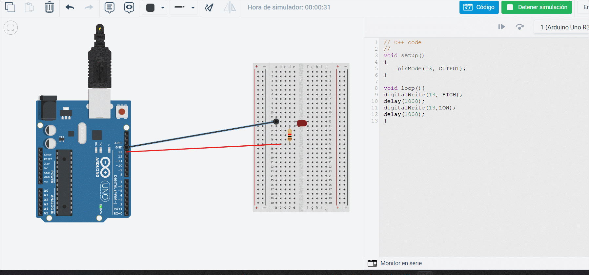
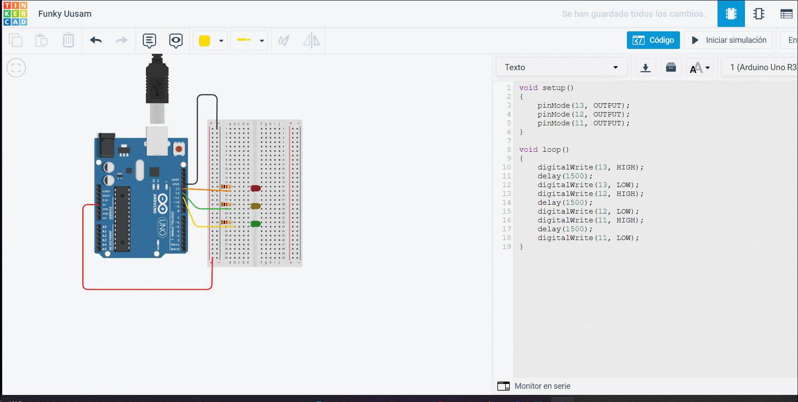
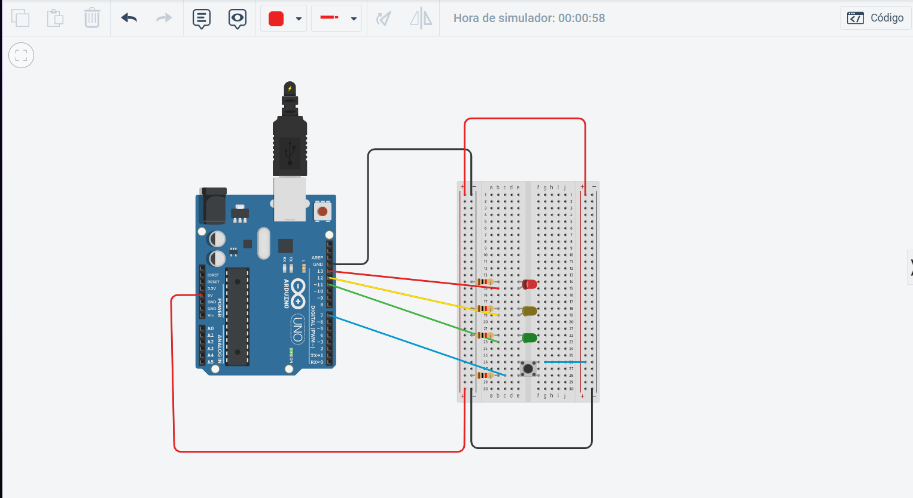
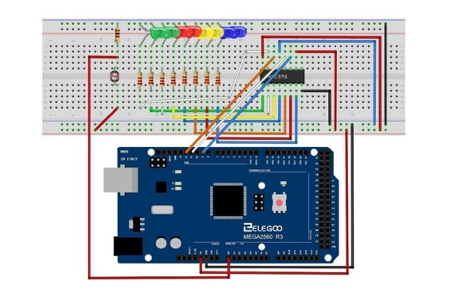

# [P3]: Experimentación con Arduino

*Miembros que han realizado esta práctica: Daniel Carrasco Moreno y Antonio Fernández Ortega(Grado de Ingeniería Informática, Universidad de Granada)*


### Introducción

Para esta práctica tenemos que desarrollar varios circuitos haciendo uso del kit de Arduino (en nuestro caso, ARDUINO UNO STARTER PACK). Para realizar los esquemas de los circuitos, hemos utilizado el simulador [Tinkercad](https://www.tinkercad.com). El montaje realizado en el laboratorio de prácticas se muestra en una serie de vídeos que se añaden en cada sección.

### [1] Ejemplo - Circuito básico LED
Partimos del ejemplo del seminario 3 en el que tenemos que construir un circuito que se enciende y se apaga cada segundo:



### [2] Proyectos a implementar

[Ejercicio 1] 

Implementar el programa de parpadeo de LED, ampliándolo para que encienda
y apague alternativamente tres LEDs (uno rojo, otro amarillo y otro verde),
conectados a las salidas digitales 11, 12 y 13 del Arduino, a un intervalo de 1.5
segundos. Crear el esquema con Fritzing y cargar el programa en Arduino para
comprobar que funciona correctamente.



Partiendo del esquema del Ejemplo del LED, lo único que hacemos es añadir 2 LEDs más al circuito y configurarlos para que se apaguen consecutivamente en un intervalo de 1.5 segundos por LED (delay = 1500).

Aquí mostramos el código empleado:

```c
#define LED_PIN0 13
#define LED_PIN1 12
#define LED_PIN2 11

void setup()
{
  pinMode(LED_PIN0, OUTPUT);
    pinMode(LED_PIN1, OUTPUT);
    pinMode(LED_PIN2, OUTPUT);
}

void loop()
{
    digitalWrite(LED_PIN0, HIGH);
    delay(1500);
  digitalWrite(LED_PIN0, LOW);
    digitalWrite(LED_PIN1, HIGH);
    delay(1500);
  digitalWrite(LED_PIN1, LOW);
    digitalWrite(LED_PIN2, HIGH);
    delay(1500);
    digitalWrite(LED_PIN2, LOW);
}
```

Video demo del circuito:


[Ejercicio 2]

Partir del programa de parpadeo de LEDs anterior y ampliarlo con las
modificaciones necesarias para que se encienda el LED rojo solo cuando se
pulse un interruptor conectado a la entrada digital 7, y en ese momento se
apaguen los LEDs amarillo y verde.


Esquema del circuito:



En este ejemplo, añadimos un botón pulsador al digital pin 7 de la placa Arduino. La idea es, leer la entrada del botón y para cado caso (es decir,
BOTON == HIGH || BOTON == LOW) encenderemos el led rojo o los otros dos.


Código empleado:

```c
#define BUTTON_PIN 7
#define LED_PIN0 13
#define LED_PIN1 12
#define LED_PIN2 11

void setup() { // código de inicialización (se ejecuta una vez al principio)
 pinMode(LED_PIN0, OUTPUT);
 pinMode(LED_PIN1, OUTPUT);
 pinMode(LED_PIN2, OUTPUT);
 pinMode(BUTTON_PIN, INPUT);
}
void loop() { // código del programa principal (se ejecuta repetidamente)

  if(digitalRead(BUTTON_PIN) == HIGH) {
    digitalWrite(LED_PIN0, LOW);
    digitalWrite(LED_PIN1, HIGH);
    digitalWrite(LED_PIN2, HIGH);
  }else{
    digitalWrite(LED_PIN0, HIGH);
    digitalWrite(LED_PIN1, LOW);
    digitalWrite(LED_PIN2, LOW);
    delay(3000);
  }

 
}
```
Video demo del circuito:


### [Ejercicio para subir nota - 2] - Alarma por detección de presencia

Debido a los problemas que ocasionaba al resto de compañeros , nosotros hemos decidido utilizar en lugar de un detector de presencia, una foto-resistencia. Entonces, cuando la foto-resistencia reciba mas o menos luz, encenderá más o menos leds.

Esquema del circuito:



Código del circuito:


```c

int sensorValue;
int sensorLow  = 1023;
int sensorHigh = 0;
const int ledPin = 13;
int lightPin = 0;
int latchPin = 11;
int clockPin = 9;
int dataPin = 12;
int leds = 0;

voit setup(){

    pinMode(latchPin, OUTPUT);
    pinMode(dataPin, OUTPUT);
    pinMode(clockPin, OUTPUT);
    pinMode(ledPin, OUTPUT);

    digitalWrite(ledPin, HIGH);

    while(millis() < 5000){
        sensorValue = analogRead(A0);
        if(sensorValue > sensorHigh){
            sensorHigh = sensorValue;
        }
        if(sensorValue < sensorLow){
            sensorLow = sensorValue;
        }
    }

    digitalWrite(ledPin, LOW);

}

void updateShiftRegister(){
    digitalWrite(latchPin, LOW);
    shiftOut(dataPin, clockPin, LSBFIRST, leds);
    digitalWrite(latchPin, HIGH);
}

void loop(){
    int reading = analogRead(lightPin);
    int numLEDSLit = reading / 57;
    if(numLEDSLit > 8) numLEDSLit = 8;
    leds = 0;
    for(int i = 0; i < numLEDSLit; i++){
        leds = leds + (1 << i);
    }
    updateShiftRegister();

    sensorValue = analogRead(A0);

    int pitch = map(sensorValue, sensorLow, sensorHigh, 50, 4000);

    tone(8, pitch, 20);

    delay(10);
}

```

Vídeo-demo del circuito:
