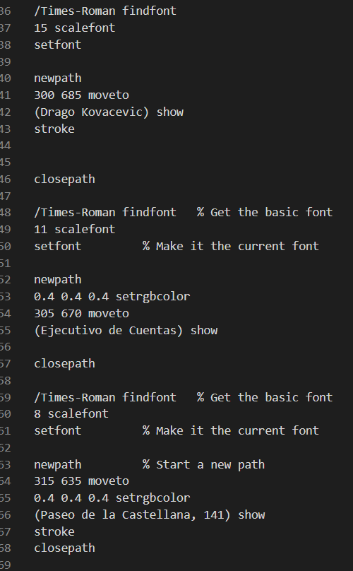

# Práctica 4

  

*Miembros que han realizado esta práctica: Daniel Carrasco Moreno y Antonio Fernández Ortega(Grado de Ingeniería Informática, Universidad de Granada)*

### Introducción

La Práctica 4 trata del uso del lenguaje Postcript. 
Los objetivos concretos de esta práctica, según el guión, serán:

- Conocer la sintaxis básica de Postscript
- Crear varios archivos y comprobar el funcionamiento con un visor Postscript(en nuestro caso, hemos usado el visor de imágenes por defecto de Ubuntu/Windows).
- Transformar los ejemplos a otros formatos de archivo, como PDF.

#### Sobre el lenguaje PostScript
El lenguaje PostScipt (PS) es el código de programación que se usa para especificarle a una impresora qué y cómo debe imprimir, paso a paso.

PS es un lenguaje interpretado que necesita un procesador o intérprete entre el código PS y la impresora física.

### Ejercicio 1: Dibujo de una casa.

Esta página muestra el dibujo de una casa junto con un texto en vertical a su lado.

Para realizar este ejercicio, hemos implementado el siguiente código [ejercicio1.ps](archivos/ejercicio1.ps).

Código empleado:

El resultado de procesar el archivo `.ps` es el siguiente. Además , se han generado el siguiente [PDF](archivos/ejercicio1.pdf) y el siguiente [JPG](archivos/ejercicio1.jpg):

### Ejercicio 2: Tarjeta de visita

Este ejercicio consiste en diseñar una tarjeta de visita con un logo y datos de contacto.
En este caso, el código se ha ido organizando por bloques , en el que cada bloque hace referencia a una sección de la tarjeta de visita.

Como se hizo en el ejercicio 1 , además de la imagen obtenida a partir de procesar el archivo `.ps` se ha generado el siguiente [PDF](archivos/ejercicio2.pdf) y el siguiente [JPG](archivos/ejercicio2.jpg):

### Ejercicio 3 : Corazon (opcional para subir nota)

Este diseño consite en el dibujo de un corazón y un texto en varios tonos de gris. Como hemos hecho en ejemplos anteriores, hemos estructurado el código en bloques, en el que cada bloque se dibuja una parte del objeto en conjunto.

Para el dibujo del corazon, he dibujado 2 circunferencias tangentes exteriores y un triángulo . Posteriormente los he pintado rellenandolas de rojo para simular la forma de un corazón.

A continuacion se muestra el código implementado del archivo `.ps`:

Al igual que en el resto de ejemplos, además del archivo `.ps` se ha generado el siguiente [PDF](archivos/ejercicio3.pdf) y el siguiente [JPG](archivos/ejercicio3.jpg).

