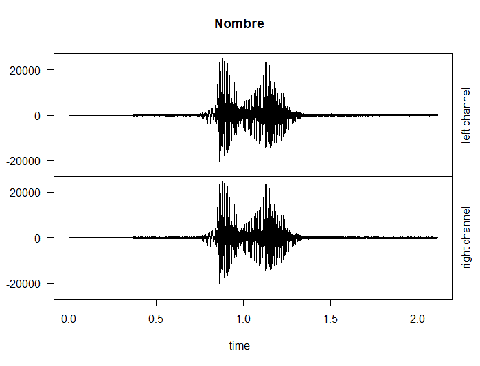
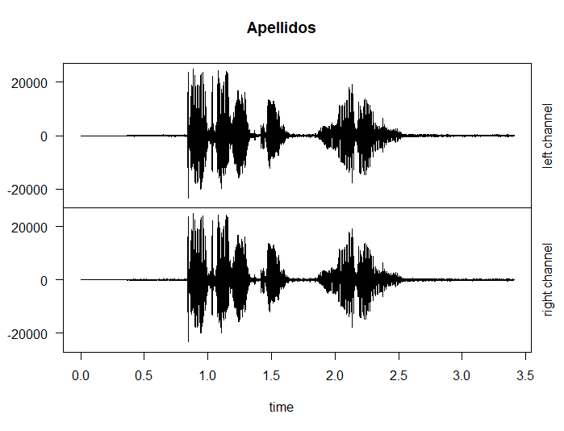
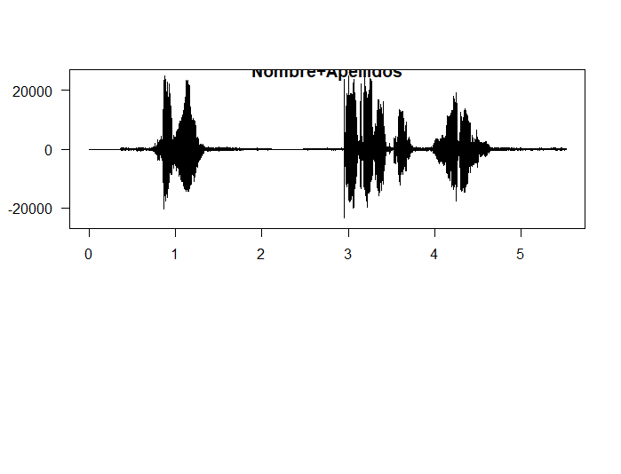

# Práctica 4: Experimentación con el sistema de salida de sonido

Para el desarrollo de la práctica se propone el uso de las siguientes funciones estudiadas previamente en el seminario 5:
 - `readWave()`: Leer una onda de sonido.
 - `readMP3()`: Leer un fichero MP3.
 - `str()`: Obtener información de la cabecera.
 - `listen()`: Reproducir el fichero leído.
 - `plot()`: Dibujar onda de sonido.
 - `cutw()`: Cortar onda de sonido.
 - `pastew()`: Pegar onda de sonido.
 - `deletew()`: Borrar la onda.
 - `bwfilter()`: Aplicar un filtro de frecuencia a la onda.
 - `echo()`: Aplicar efecto de eco.
 - `revw()`: Dar la vuelta al sonido (reverse).

#### Cuestiones a resolver

En primer lugar,  debemos  instalar los paquetes que vamos a usar y cargarlos. Para ello ejecutamos lo siguiente:

```
install.packages('tuneR', dep=TRUE)
install.packages('seewave', dep=TRUE)

library(tuneR)
library(seewave)
library(audio)
```
1.  Leer dos ficheros de sonido (WAV o MP3) de unos pocos segundos de 
duración cada uno. En el primero debe escucharse el nombre de la persona 
que realiza la práctica. En el segundo debe escucharse el apellido

```
nombre <- readMP3('./nombre.mp3')
nombre
listen(nombre)


apellidos <- readMP3('./apellidos.mp3')
apellidos
listen(apellidos)
```

2. Dibujar la forma de onda de ambos sonidos.

```
plot( extractWave(apellidos, from = 1, to = length(apellidos)), main="Apellidos" )
plot( extractWave(nombre, from = 1, to = length(nombre)), main="Nombre" )
```



3.  Obtener la información de las cabeceras de ambos sonidos

```
> str(apellidos)
Formal class 'Wave' [package "tuneR"] with 6 slots
  ..@ left     : int [1:163584] 0 0 0 0 0 0 0 0 0 0 ...
  ..@ right    : int [1:163584] 0 0 0 0 0 0 0 0 0 0 ...
  ..@ stereo   : logi TRUE
  ..@ samp.rate: num 48000
  ..@ bit      : num 16
  ..@ pcm      : logi TRUE
> str(nombre)
Formal class 'Wave' [package "tuneR"] with 6 slots
  ..@ left     : num [1:101376] 0 0 0 0 0 0 0 0 0 0 ...
  ..@ right    : num [1:101376] 0 0 0 0 0 0 0 0 0 0 ...
  ..@ stereo   : logi TRUE
  ..@ samp.rate: num 48000
  ..@ bit      : num 16
  ..@ pcm      : logi TRUE
```

4. Unir ambos sonidos en uno nuevo

Como hemos visto en las ondas del ejercicio 2, la señal del sonido de nombre tiene menos amplitud, por lo que antes de unir los sonidos he decidido normalizarlos.

```
nombre@left <- nombre@left * (max(apellidos@left)/max(nombre@left))
nombre@right <- nombre@right * (max(apellidos@right)/max(nombre@right))
nombre_apellidos <- pastew(apellidos, nombre, output="Wave")

listen(nombre_apellidos)
```
5. Dibujar la forma de onda de la señal resultante.

```
plot( extractWave(nombre_apellidos, from = 1, to = length(nombre_apellidos)), main="Nombre+Apellidos" )
```



