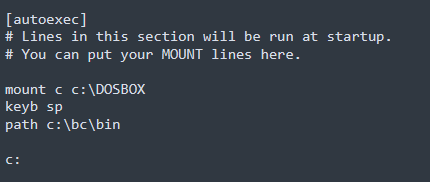
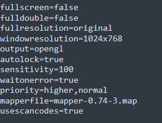
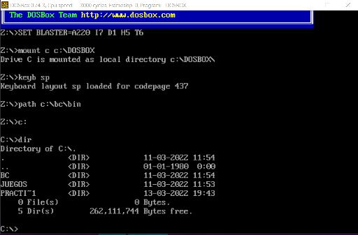
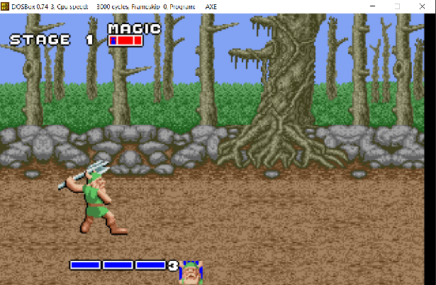
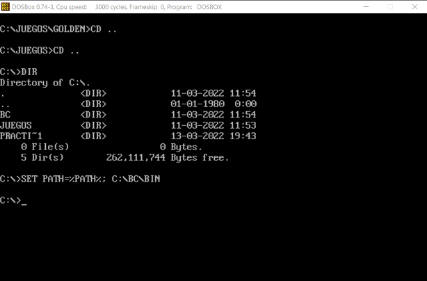

# Seminario 1 : Programación de dispositivos a bajo nivel

<ol>
  <li> 
<strong>Instalar el software DOSBox y ejecutar aplicaciones de MS-DOS (p.ej. juegos clásicos).</strong>
 </li>
  Para instalar dosbox he seguido uno de los tutoriales que se indican en los enlaces del final del guión
  del seminario. En mi caso, lo he instalado en un Windows 10 de 64 bits.
  
  Para agilizar el trabajo, he configurado el archivo dosbox-0.74-3.conf ubicado en   
 `C:\Users\danic\AppData\Local\DOSBox`. 
  
  Configuramos el archivo `dosbox-0.74-3.conf` para que DOSBox se monte directamente en la unidad C: , 
  concretamente en `C:DOSBOX`. Añadimos tambien la opción para utilizar por defecto el teclado en español e
  indicamos que las utilidades de compilación están en ese path (en c:\bc\bin).
  
  

    
  

  
  Además configuramos el tamaño por defecto de la ventana de dosbox para agrandarla un poco:

  

    
  

  A continuación, muestro como se vería dosbox una vez iniciado y montado en la unidad C: de mi 
  equipo:

  

    
  

  Para mostrar el funcionamiento de DOSBOX, vamos a ejecutar un juego clásico de MS-DOS. En este caso
  vamos a jugar a Golden. Para ello nos situamos en la carpeta `C:\DOSBOX\JUEGOS` y en la carpeta `golden`
  ejecutamos GOLD.EXE para arrancar el juego. Nos aparecerá un menú para elegir el tipo de configuración
  gráfica, en mi caso voy a elegir VGA (256 colores):

  

    
  

  
  <li>
      

          <strong>  Configurar el inicio de DOSBox para que monte en la unidad C: el directorio donde se 
        encuentra el entorno de programación Borland C .  Añadir a la variable “PATH” de 
        inicio el directorio “bin” donde se encuentra el ejecutable BC.EXE
          </strong>
      

</li>

El resultado se puede apreciar en la tercera captura de pantalla del apartado anterior. Lo que hago es extraer
la carpeta `BC` en el directorio principal de DOSBOX. Para añadirlo al path, lo que he tenido que escribir es
`set path=%path%;c:\bc\bin`

Con esto ya podemos tanto compilar ensamblador (.ASM) como C (.C)

  

    
  

  <li> 
<strong>Crear el ejemplo “Hola mundo” en ensamblador, compilarlo y comprobar su 
funcionamiento. A continuación incluir un bucle para mostrar el mensaje 7 veces.</strong>
</li>
</ol>
